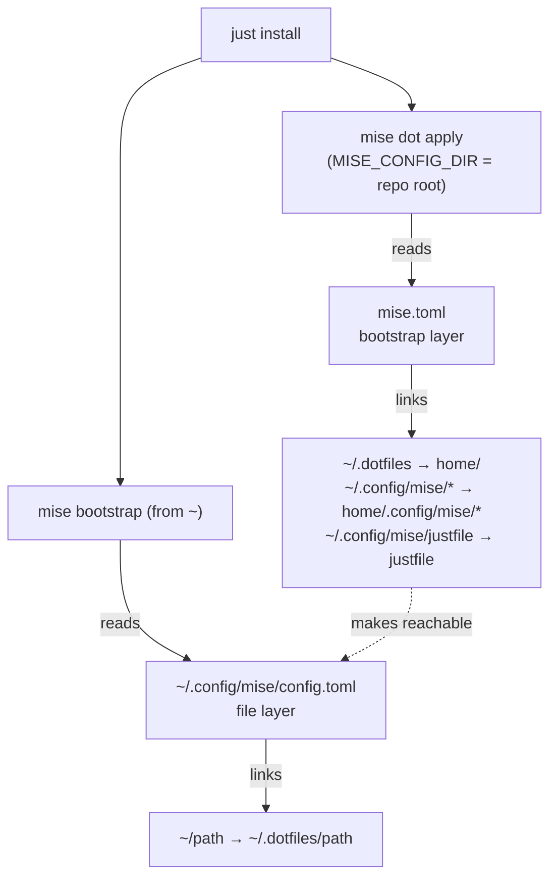

# dotfiles

Personal dotfiles, symlinked into `$HOME` by mise's built-in dotfiles manager
([`mise dot`](https://mise.jdx.dev/dotfiles.html)). CLI tools are installed by
[`mise`](https://mise.jdx.dev) from `home/.config/mise/config.toml`.

## Setup

Prerequisites: `git` and a `mise` recent enough to support `mise dot` variants (2026.9.17
works), plus Homebrew on macOS, which `mise bootstrap` drives to install formulae and casks.
mise installs everything else.

```sh
git clone https://github.com/fresh2dev/dotfiles ~/projects/github.com/fresh2dev/dotfiles
cd ~/projects/github.com/fresh2dev/dotfiles
MISE_CONFIG_DIR="$PWD" mise install   # the repo's own tools, from mise.toml
MISE_CONFIG_DIR="$PWD" mise en        # a subshell with them on PATH
just install                          # link both layers and set up the machine (see below)
```

`MISE_CONFIG_DIR="$PWD"` makes mise read only this repo's `mise.toml`.
`just install` applies the bootstrap layer, then runs `mise bootstrap` from `~`, which
links the file layer and applies the rest of the global config: Homebrew taps, formulae and
casks, user services, macOS settings, tools, and hooks. Last, it clones zsh plugins and
installs agent skills. Its arguments reach only `mise bootstrap`, so
`just install --dry-run` previews that step but still applies the bootstrap layer and
installs plugins and skills.

Then open a new shell. The linked shell config activates mise, and the bootstrap layer has
linked this repo's `justfile` to `~/.config/mise/justfile`, so `bs <recipe>` (short for
`bootstrap`, an alias for `just -f $MISE_CONFIG_DIR/justfile`) runs its recipes from any
directory.

Links that already resolve to the right file count as `applied`, so re-running
`just install` on a machine that is already set up is safe.

### Dotfiles only

To link the dotfiles without installing packages or tools, changing macOS settings, or
starting services, apply the two layers with `mise dot` directly. This needs only `git`
and `mise`:

```sh
git clone https://github.com/fresh2dev/dotfiles ~/projects/github.com/fresh2dev/dotfiles
cd ~/projects/github.com/fresh2dev/dotfiles
MISE_CONFIG_DIR="$PWD" mise dot apply   # bootstrap layer
cd ~ && mise dot apply                  # file layer
```

Add `--dry-run` to either `mise dot apply` to preview it. The linked mise config is now
your global config, so a new shell activates mise and lazy tools install on first use;
`mise install` installs the eager ones. Run `just install` later to set up the rest.

## Layout

| Path | Purpose |
|---|---|
| `mise.toml` | Bootstrap layer, plus the few tools the `justfile` needs before anything is linked |
| `home/` | Every dotfile, each at its `$HOME`-relative path |
| `home/.config/mise/config.toml` | File layer. mise's global config, which also pins every other tool |
| `home/.config/mise/config.macos.toml` | macOS-only bootstrap config: Homebrew packages, services, LaunchAgents, Dock and Finder settings |
| `justfile` | Recipes for installing, upgrading, and formatting, linked to `~/.config/mise/justfile` and run with `bs`. `bs --list` shows them, a bare `bs` opens a chooser |
| `.treefmt.toml` | treefmt config for this repo |
| `.pre-commit-config.yaml` | [prek](https://prek.j178.dev) hooks: whitespace fixers and syntax, symlink, and safety checks. `prek install` enables them as a git hook |

Linking happens in two layers, each with its own `[dotfiles]` table.



### The bootstrap layer: `mise.toml`

This layer only makes the file layer reachable. It links `~/.dotfiles` to `home/` in this
checkout, links each file in `home/.config/mise` into a real `~/.config/mise` directory
(`symlink-each`), and links the repo's `justfile` to `~/.config/mise/justfile`. Once
applied, mise's global config holds the file layer. Don't add other dotfile entries here.

Its `[tools]` table pins only what the repo's `justfile` needs, by major version, so those
tools install before the global config exists.

### The file layer: `home/.config/mise/config.toml`

The `[dotfiles]` table in the global config has one entry per linked path, keyed by its
`~/…` target. The same file sets mise's dotfiles root to `~/.dotfiles` and the default mode
to `symlink`, so an empty entry links `~/<path>` to `home/<path>`:

```toml
"~/.zshrc" = {}
```

An entry can name a single file or a whole directory, and can set `source` to link a target
to a different path under `home/`.

macOS-only entries add an `os = "macos"` variant, which mise applies on macOS and skips
everywhere else. An entry with a variant needs an explicit `mode`; with only `variants`,
mise warns "no recognized operation" and ignores it:

```toml
"~/.hushlogin" = { mode = "symlink", variants = [{ os = "macos" }] }
```

## Which layer `mise dot` sees

Where you run `mise dot` decides which layer it reads:

- **Outside this repo**, your shell's `MISE_CONFIG_DIR` (`~/.config/mise`) applies, so
  `mise dot` reads the global config: the file layer.
- **With `MISE_CONFIG_DIR="$PWD"` at the repo root**, `mise dot` reads only `mise.toml`:
  the bootstrap layer.

A bare `mise dot` inside the repo reads both layers and fails with "conflicting dotfile
declarations". Set `MISE_CONFIG_DIR="$PWD"` there, or `cd ~` first for the file layer.

| Command | Effect |
|---|---|
| `bs install [args…]` | Apply both layers and the rest of `mise bootstrap` |
| `MISE_CONFIG_DIR="$PWD" mise dot <subcommand>` | `mise dot <subcommand>` for the bootstrap layer, from the repo root, e.g. `status`, `apply`, `diff` |
| `cd ~ && mise dot <subcommand>` | The same for the file layer |
| `bs upgrade [args…]` | Prune, then upgrade mise, tools (bumping their pins), Homebrew packages, zsh plugins, and agent skills |
| `bs prune [args…]` | Remove unused tool versions, undeclared Homebrew formulae, and undeclared casks that mise installed |
| `bs dir` | Print the path of this checkout, e.g. `cd "$(bs dir)"` |
| `bs format` | `treefmt` on the repo, using `.treefmt.toml`, then prek's whitespace fixers |

## Homebrew packages

`mise bootstrap` manages Homebrew on macOS; there is no Brewfile. Taps, formulae, and casks
are declared in `home/.config/mise/config.macos.toml`:

```toml
[bootstrap.brew.taps]
"rcmdnk/file" = "https://github.com/rcmdnk/homebrew-file.git"

[bootstrap.packages]
"brew:syncthing" = "latest"
"brew-cask:ghostty" = "latest"
```

Add an entry and run `bs install` to install it. To uninstall one, remove its entry and run
`bs prune`, which removes undeclared formulae and any undeclared cask that mise installed
(casks installed before mise managed them are left alone).

## Adding a file

> [!IMPORTANT]
> Run `mise dot add` **outside** this repo. Inside it, a bare `mise dot` fails (see above),
> and `MISE_CONFIG_DIR="$PWD" mise dot add` targets the bootstrap layer, not the file layer.

From `$HOME` (or anywhere outside the repo), `mise dot add` moves the file into `home/`,
adds a `"~/<path>" = {}` entry to the global config (writing through the symlink into this
repo), and links it:

```sh
cd ~
mise dot add ~/.config/foo/config.toml
```

Given a directory, `mise dot add` links the whole directory. For a macOS-only file, add the
`mode` and `variants` shown above to its entry by hand.

To add a file by hand instead, put it under `home/` at its `$HOME`-relative path, add
`"~/<path>" = {}` to the global config's `[dotfiles]` table, then run
`cd ~ && mise dot apply ~/<path>`.

## Neovim

The Neovim config in `home/.config/nvim/` is extensive enough to have its own
documentation: [`home/.config/nvim/README.md`](home/.config/nvim/README.md) covers its
requirements, layout, keymaps and plugins, and how to extend it. It is linked as a whole
directory, so it follows the same two-layer setup as everything else here.
